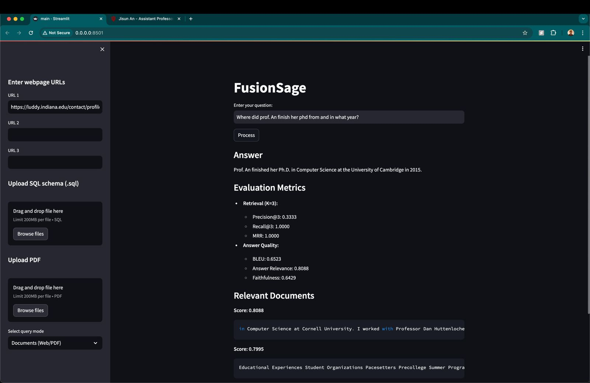

# FusionSage


FusionSage is an integrated Retrieval Augmented Generation system that integrates multiple data sources: websites, uploaded PDF documents, and database files.

Hosted with Streamlit, uses Langchain with GPT-3.5 turbo, PineconeDB, and CassandraDB.

## Deployment

Install dependiencies using the `requirements.txt` file:

```console
$ pip install -r requirements.txt
```

And then deploy the streamlit application for localhost using:

```console
$ streamlit run main.py
```

## Using the RAG


The `PINECONE_API_KEY` and `OPENAI_API_KEY` environment variables are needed to be set before running the application.

The vector weights calculated by the retriever module are stored in the Pinecone vector database, which is visible on the web dashboard.

### With Webpages



You can upload up to 3 webpage sources that will be read for the context for the system. The query and the context will be sent to the language generation model to generate the answer. The answer is evaluated on its retrieval and answer generation capabilities using precision, recall, mean reciprocal rank, BLEU, relevance, and faithfulness metrics.

### With Uploaded PDF


The uploaded pdf file contents are read and the chunked vector weights are stored into the Pinecone database, the process afterwards is the exact same as the web sources. The same evaluation metrics are also applied for retrieval and answer generation.

### With Uploaded Database


The database mode is activated by selecting the corresponding option in the dropbox at the end of the sidebar. An SQL file is uploaded that will be compiled into sqlite3 to perform the querying operations. The prompt entered by the user is used to generate an sql query, which is shown on the frontend and is then executed on the given database. The result of executing the SQL generated query is again sent to the language model for generating an answer line with natural language. The evaluation metrics used are SQL query generation time, number of rows returned, and answer generation time.

## Team Members

[](https://github.com/adhumal007) [](https://github.com/hrushikesh070902) [](https://github.com/Darshula)
